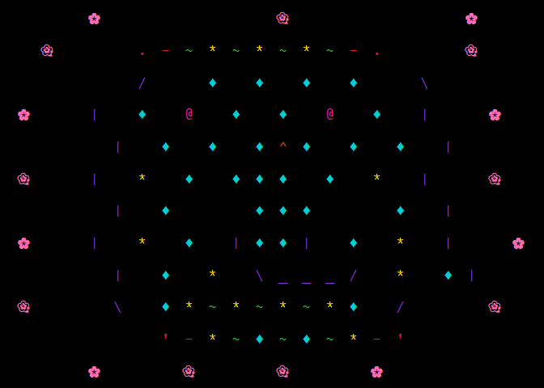

# Why Quarto?

Why not.

## Melodía Ancestral

I asked Posit’s [**Shiny
Assistant**](https://gallery.shinyapps.io/assistant) to make some AASCI
art in [`{ggplot2}`](https://ggplot2.tidyverse.org/) and a [Sugar Skull
designer
app](https://amelialouise.shinyapps.io/everybody-git-together/).

<a href="#fig-skull" class="quarto-xref">Figure 1</a> shows the
magnificent Melodía Ancestral, which Shiny also named. Neat.

Figure 1: Shiny Assistant’s ASCII sugar skull art

